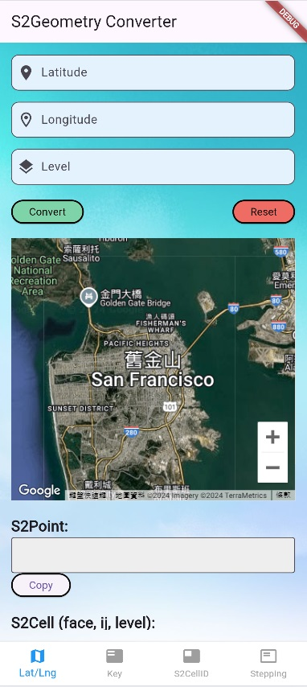
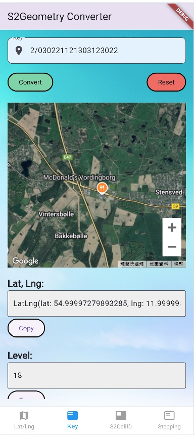
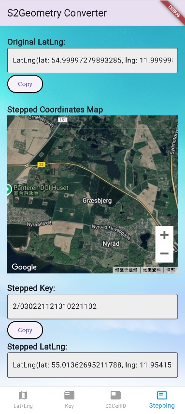

# S2Geometry Flutter Demo

This Flutter project demonstrates how to use [s2geometry_dart](https://pub.dev/packages/s2geometry_dart) package https://pub.dev/packages/s2geometry_dart to work with geographic coordinates, S2 Cells, and perform related transformations. The app allows users to convert between latitude/longitude, S2 Cell IDs, Hilbert keys, and visualize these on Google Maps.

## Features

- Lat/Lng: Convert geographic coordinates (latitude/longitude/level) to S2Point, S2Cell, Key, S2CellId, Neighbor Keys and visualize the coordinate on Google Maps.

- Key: Convert S2 Hilbert keys to lat/lng/level, S2Cell, S2CellId, Next Key, Previous Key and visualize the coordinate of the key.

- S2CellID: Convert S2 Cell IDs to lat/lng/level, Key, S2Cell and visualize the coordinate of S2CellID.

- Stepping: Traverse through neighboring S2 Cells based on the Hilbert curve.

## Project Structure

- lib/main.dart: Entry point of the application.
- lib/latlng.dart: Lat/Lng feature screen
- lib/key.dart: Key feature screen
- lib/id.dart: S2CellId feature screen
- lib/stepping.dart: Stepping feature screen

## Getting Started

### Requirements

- flutter https://docs.flutter.dev/get-started/install

### Installation

- Clone the Repository:
```bash
git clone https://github.com/h102136/s2_flutter_demo

cd s2_flutter_demo
```
- Run the App
```dart
flutter run
```
## How to Use

- Select the feature you want to use (e.g., Lat/Lng, Key etc.)

- Input the parameters

- Click the Convert button to see the results.

- The map updates to show the geographic location, based on your input.

- You can Reset the fields using the Reset button.

- Use Copy button to copy the result

<p align="center">
  
  
  
</p>


## Running Tests

```bash
flutter test
```

## Built With
 - Flutter - The framework used for building cross-platform apps.
 https://flutter.dev/
 - s2geometry_dart - https://pub.dev/packages/s2geometry_dart
 - google_maps_flutter - A Flutter plugin for integrating Google Maps in iOS and Android applications.
 https://pub.dev/packages/google_maps_flutter